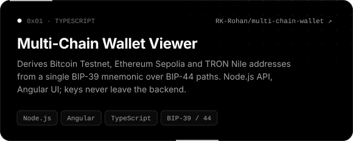
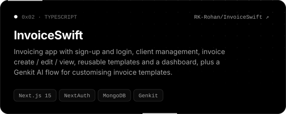
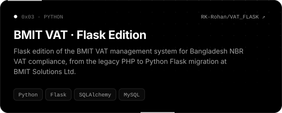
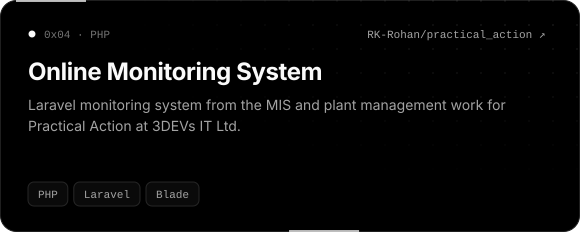
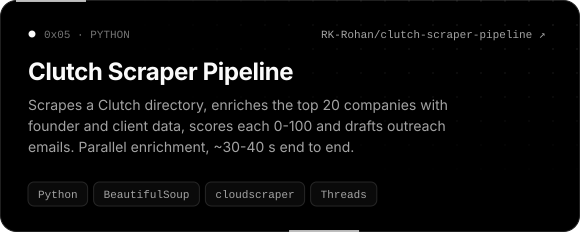
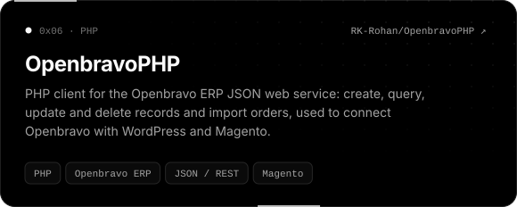
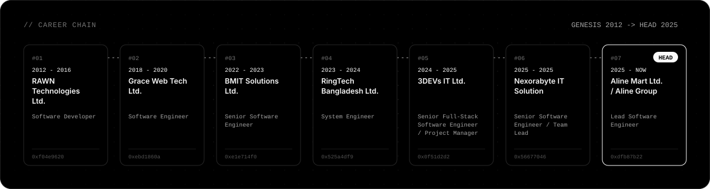

<!--
  GitHub profile README for RK-Rohan.
  The SVGs in assets/ are generated: edit scripts/data.mjs, then run `node scripts/generate.mjs`.
  See MAINTAINING.md.
-->

  
  
  

 

### `0x01` &nbsp;About

Lead Software Engineer and Engineering Team Lead with **10+ years** across e-commerce, ERP, fintech, VAT / compliance systems and telecom. My work spans software architecture, engineering leadership, DevOps, scripting and automation, from multi-tenant commerce platforms and mobile-wallet payment integrations to NBR VAT systems and Openbravo ERP / POS rollouts.

- **Now:** Lead Software Engineer at **Aline Mart Ltd. / Aline Group**, leading multi-brand, multi-tenant e-commerce
- **Payments:** bKash, Nagad, Rocket and Upay integrations with webhooks and JWT-secured APIs
- **Leadership:** sprint planning, code reviews, technical roadmaps and mentoring

 

### `0x02` &nbsp;Skill Ledger

  
  
  
  
  
  
  
  
  
  
  
  
  
  
  
  

 

### `0x03` &nbsp;Featured Work

  
  

  
  

  
  

 

### `0x04` &nbsp;Current Work

| | |
| :-- | :-- |
| **Aline Mart Ltd. / Aline Group**  Lead Software Engineer · since 2025 | Engineering leadership for multi-brand, multi-tenant e-commerce: backend services, admin systems, storefront and mobile apps. Catalogue, inventory, checkout, order lifecycle, returns and settlement, with payment and courier integrations, Docker and CI/CD. |
| **[rezaul-karim.com](https://www.rezaul-karim.com)**  Personal site | Interactive profile with a three.js node globe, a career chain, role lenses, a terminal, a command palette and a printable ATS-friendly CV. Vite, React, TypeScript, three.js and Framer Motion. |
| **Remote Job Aggregator**  Personal project | Pulls remote software roles from several job boards, keeps the ones that hire from anywhere, scores them against a target stack and sends matches to Telegram. FastAPI + Next.js dashboard with a career profile and a CV maker. |

 

### `0x05` &nbsp;Career Chain

 

### `0x06` &nbsp;Selected Repositories

| Repository | What it is | Stack |
| :-- | :-- | :-- |
| [**WebSalesJavaPOS**](https://github.com/RK-Rohan/WebSalesJavaPOS) | Web sales reports for Openbravo JavaPOS: daily sales, daily statements and weekly sales charts | PHP |
| [**SyncJavaPOS**](https://github.com/RK-Rohan/SyncJavaPOS) | Data-sync process for Openbravo JavaPOS deployments | Java |
| [**JSON-content-importer**](https://github.com/RK-Rohan/JSON-content-importer) | Reads data from Openbravo into WordPress | PHP |

 

### `0x07` &nbsp;Network Activity

  
  

<picture>
  <source media="(prefers-color-scheme: dark)" srcset="https://raw.githubusercontent.com/RK-Rohan/RK-Rohan/output/snake-dark.svg" />
  <source media="(prefers-color-scheme: light)" srcset="https://raw.githubusercontent.com/RK-Rohan/RK-Rohan/output/snake-light.svg" />
  
</picture>

 

### `0x08` &nbsp;Connect

  
  

The full profile, experience and a printable CV are on <a href="https://www.rezaul-karim.com">rezaul-karim.com</a>.
